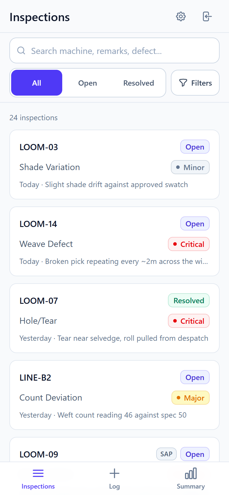
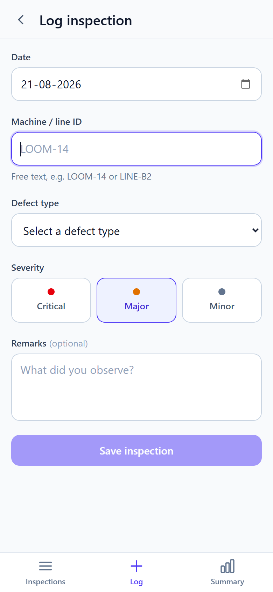
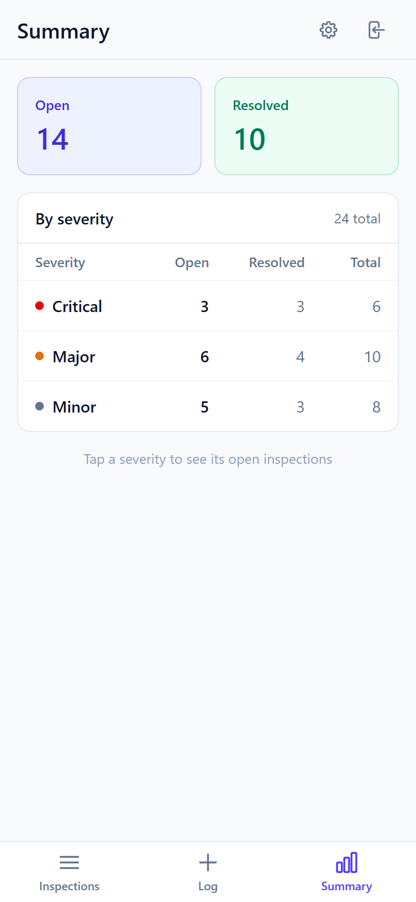

# Quality Inspection Tracker

[](https://github.com/sanjaykhoda/fsd-assignment/actions/workflows/ci.yml)

A mobile-first web app for shop-floor supervisors to log, track and resolve
quality defects from a phone. Built for the FSD assignment.

React + TypeScript SPA, Express REST API, SQLite. One container, one port, no
external services.

| Inspections | Log a defect | Summary |
| --- | --- | --- |
|  |  |  |

<sub>Captured at 390 × 844 — the target viewport from the brief.</sub>

---

## Demo credentials

```
username: supervisor
password: inspect123
```

**The login form ships prefilled with these** — just press Sign in.

---

## Quick start

### Docker (recommended)

```bash
docker compose up --build
```

Open <http://localhost:4000>. The database is created, migrated and seeded with
24 demo inspections on first boot, so the app has data immediately.

To start from an empty database: `docker compose down -v`.

### Without Docker

Needs Node ≥ 20.19 (see `.nvmrc`).

```bash
npm install
npm run dev
```

Open <http://localhost:5173>. Vite serves the SPA and proxies `/api` to the
Express server on port 4000.

### Other commands

| Command | Does |
| --- | --- |
| `npm test` | Runs the 49 API tests |
| `npm run seed` | Wipes and reinserts the demo inspections |
| `npm run build && npm start` | Production build; one process serves API + SPA on :4000 |

> **On verification:** the `npm` path above was developed and tested directly on
> my machine. Docker is not installed there, so rather than claim a path I had
> not executed, I made CI execute it: every push builds the image, boots the
> stack, and asserts health, SPA deep links, an authenticated log-and-resolve
> round trip, and SAP webhook idempotency against the running container — plus
> the test suite on both Linux and Windows runners. The badge above covers all
> of that.

---

## Features

**Required**

- Log an inspection — date, machine/line ID, defect type, severity, remarks
- List with filtering by severity, status and date range, plus sorting and
  pagination
- Resolve an inspection with a mandatory resolution note
- Summary of open/resolved counts by severity

**Bonus**

- Mock SAP integration: `POST /api/sap-webhook`, documented in
  [docs/API.md](docs/API.md), idempotent on the notification number
- JWT authentication

**Beyond the brief**

- Defect types are managed at runtime rather than hardcoded. The brief specified
  a fixed dropdown; a plant's defect vocabulary changes, so they are rows with
  full CRUD at `/defect-types`. The five original types are seeded and locked.

Not built: **offline support**. See [What I cut](#what-i-cut-and-why).

Full endpoint reference, query parameters, error codes and the SAP payload
shape: **[docs/API.md](docs/API.md)**.

---

## Architecture decisions

**SQLite via `better-sqlite3`, behind a 25-line interface.**
The whole app is one process with an embedded database file, which is why
`docker compose up` needs no second service and no startup ordering. The driver
is synchronous, so the repository layer reads as plain SQL with no async noise.
`api/src/db/client.ts` is the only file that imports it — swapping to Node's
built-in `node:sqlite` is a one-file change, which mattered because prebuilt
native binaries are the one install step that could plausibly fail on a
reviewer's machine.

**A single `{ data, meta? }` / `{ error }` envelope.**
Chosen over bare payloads, which leave nowhere for pagination metadata except
invented headers, and over `{ success: true, data }`, whose boolean merely
restates the HTTP status. Discriminating on which key is present makes the API
one TypeScript union and means the entire frontend has exactly one unwrap
function and one error path (`web/src/lib/api.ts`).

**Resolving is `PATCH /inspections/:id/resolve`, not a status field write.**
Resolving carries an invariant — the note is mandatory, and it cannot happen
twice — so it is a state transition, not a field assignment. A generic
`PATCH /inspections/:id` would need conditional cross-field validation and would
expose fields no client should ever set. The named action makes the rule
self-documenting and gives `409` an unambiguous meaning.

**Dates are stored as `YYYY-MM-DD` strings, not timestamps.**
"The defect on the 14th" is a calendar fact in the plant's local time, not an
instant. Storing it date-only makes range filtering an exact lexicographic
comparison with both bounds inclusive and no timezone arithmetic anywhere; as a
timestamp, `to=2026-08-21` would either drop that whole day or need a boundary
that shifts under the user's offset. `createdAt` and `resolvedAt` *are* instants
and stay ISO-8601 UTC.

**Defect types are rows, not an enum.**
A hardcoded list means a code change, a review and a deploy every time the plant
adds a category. As data, the tradeoff is referential integrity: a type in use
cannot be deleted (`409`), only retired — it stays readable on existing records
but disappears from the new-inspection dropdown. History is never rewritten.

**No data-fetching library, no UI kit, no icon library.**
Six screens and two resources, with no shared cross-screen cache to coordinate.
A 40-line `useApi` hook covers it; TanStack Query would be a larger mental model
than the app it serves. The frontend has four runtime dependencies. If this grew
optimistic updates, offline writes, or a shared cross-screen cache, that
calculus would flip.

**One origin, so CORS never exists.**
In development Vite proxies `/api` to Express; in production Express serves the
built SPA. The browser only ever sees one origin in either mode, so the `cors`
package appears nowhere in this project. An external API client would need it
added.

---

## Project structure

```
api/src/
  app.ts                   express assembly: routes, static SPA, error handler
  db/client.ts             the only file importing a SQLite driver
  db/schema.sql            idempotent DDL, re-run every boot
  domain/schemas.ts        zod schemas -- the single source of validation
  inspections/repository.ts  all inspection SQL lives here
  inspections/routes.ts    thin: no SQL, no business logic
  defect-types/            runtime-managed defect vocabulary
  sap/routes.ts            mock SAP inbound webhook
  middleware/errors.ts     ApiError + the one place status codes are decided
web/src/
  lib/api.ts               one fetch path, one error type
  hooks/useApi.ts          loading / error / reload, ~40 lines
  components/              AppShell, cards, sheets, form primitives
  pages/                   List, New, Detail, Summary, DefectTypes, Login
```

---

## Mobile-first UX

Everything below was checked at 390 × 844 with no horizontal scroll on any
screen.

- **Bottom tab bar, not a hamburger.** Three destinations, all thumb-reachable.
  Logging is the supervisor's main job, so it has a permanent tab and is one tap
  from anywhere.
- **Status filter always visible** as a segmented control, since "what's still
  open?" is the constant question. Rarer filters live in a bottom sheet, and
  whatever is applied shows as removable chips — you are never stuck in a
  filtered state you cannot see.
- **Filters live in the URL.** Shareable, refresh-safe, and the Android back
  button undoes a filter. They also map 1:1 onto the API's query params, so
  there is no state-syncing code at all.
- **Native `<select>` and `<input type="date">`** so the OS pickers open. Better
  than any JS component, and zero bytes.
- **16px minimum font on form controls** — anything smaller makes mobile Safari
  zoom the viewport on focus, which strands the user mid-form.
- **44px minimum tap targets**, safe-area padding under the bottom nav.
- **Every async surface has three states**: skeleton, empty state with a way
  out, and an inline retry on error.

"Clean UI" as enforceable rules rather than taste: one accent colour with all
other colour reserved for meaning (severity and status); three type sizes and
two weights; a 4/8/12/16/24 spacing scale; 1px borders instead of shadows; six
hand-written inline SVG icons; the system font stack, so no webfont round-trip.

---

## Testing

`npm test` — 49 tests, `node:test` + `supertest` against an in-memory database,
no test framework config. They target the invariants a reviewer would try to
break:

- Resolving with an empty or whitespace-only note is rejected, and the record
  stays `Open`
- Re-resolving returns `409` and preserves the original note
- `from`/`to` are inclusive on **both** boundaries — the off-by-one that
  date-range filters ship with
- `sort=severity&order=desc` returns Critical first, not alphabetical order
- Pagination metadata is correct and pages do not repeat rows
- The SAP webhook creates once, then returns `200` on replay without duplicating
- A defect type in use cannot be deleted, and retiring one keeps old records
  readable

**Frontend tests were deliberately skipped**, and I would rather say so than
ship a thin component test for the appearance of coverage: the UI is six screens
with no branching business logic, and every invariant lives server-side where it
*is* tested. With more time, the honest addition is a Playwright smoke test of
log → filter → resolve at a 390px viewport.

---

## Assumptions

The brief asks for these to be stated rather than guessed at:

1. **One supervisor account, no multi-tenancy.** "Basic authentication, keep it
   simple" — a users table with roles and a signup flow would be inventing
   requirements. Credentials come from environment variables.
2. **Resolution is terminal.** There is no re-open. If a defect recurs it is a
   new inspection, which keeps the audit trail honest.
3. **An inspection cannot be dated in the future.** You log what you observed.
4. **Machine / line ID is free text**, exactly as specified — no machine
   registry, no validation beyond non-empty.
5. **One plant, one timezone.** Calendar dates are plant-local and stored
   without an offset.
6. **Remarks are optional; a resolution note is not.**
7. **`Other` always exists**, because the SAP webhook needs a fallback bucket
   for unrecognised defect codes.

---

## What I cut, and why

**Offline support.** The version worth shipping is a service worker with
Background Sync, which is close to a day of work and a large surface for a demo
bug. A `localStorage` write-queue would have been a couple of hours, but it
covers writes only — reads still need connectivity — so it risks reading as
"offline support" while being much less than that. With the core features and
two other bonuses done well, I judged an honest omission better than a partial
feature. It is the first thing I would build next; the schema is ready for it (a
client-supplied UUID column plus a unique index makes retries idempotent).

**A shared types workspace.** `Severity` and `Status` are declared in both
`api/src/domain/constants.ts` and `web/src/lib/constants.ts` — about ten
duplicated lines, guarded by database CHECK constraints. A third workspace would
have cost more build configuration than the duplication costs.

**A migration runner.** Two tables and one developer. The DDL is idempotent and
replays on boot; `PRAGMA user_version` is stamped as a hook for when that stops
being enough.

---

## With more time

- **Offline write queue**, as above — the highest-value missing feature.
- **Status history table.** Right now resolving overwrites; an append-only
  transition log is what a real quality system needs for audit.
- **Cursor pagination.** Offset pagination skips rows if something is inserted
  mid-scroll. Fine at this scale, wrong at ten thousand.
- **Photo attachments.** The single thing a real supervisor would ask for first
  — a defect photo is worth more than the remarks field.
- **Rate limiting and a rotating secret on the SAP webhook**, plus a delivery
  log. Right now a leaked shared secret is unbounded.
- **Playwright smoke test at 390px**, and visual regression on the three main
  screens.
- **Structured logging with request IDs.** `console.error` is not an incident
  response tool.
- **Refresh tokens.** A 12-hour JWT with no refresh means a supervisor gets
  logged out mid-shift.
